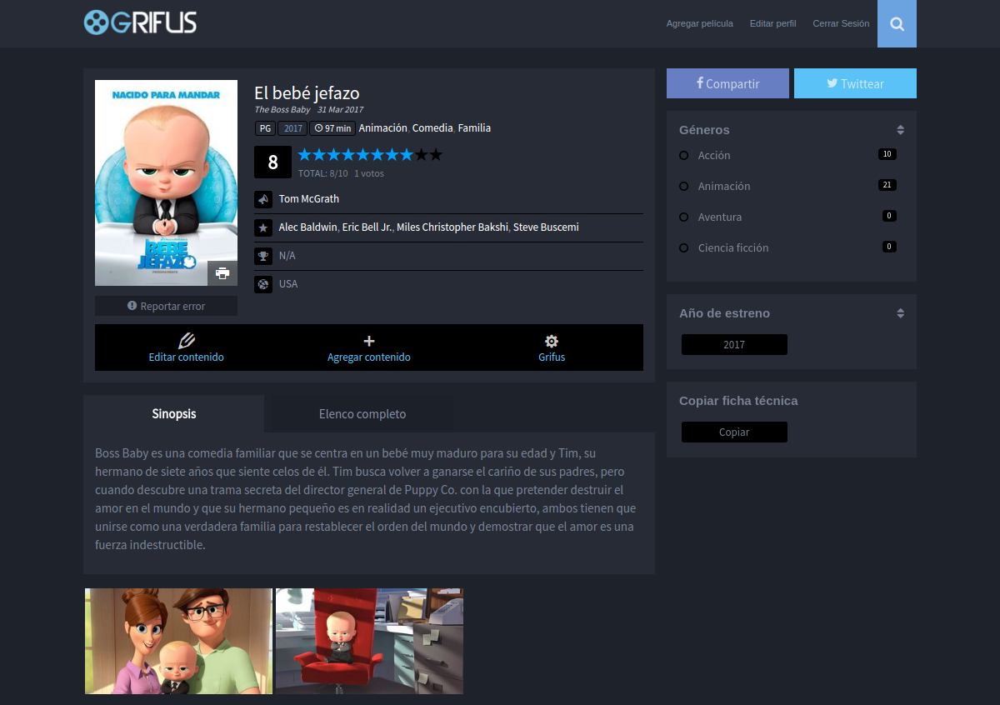
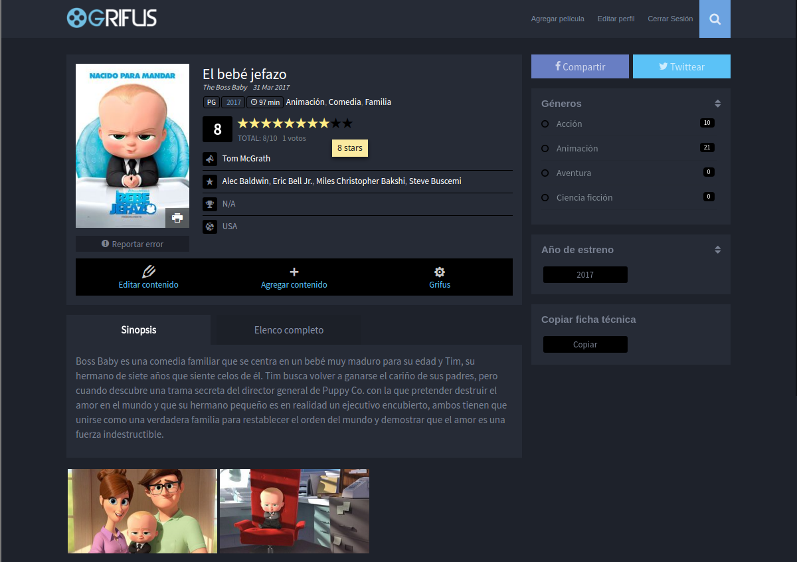
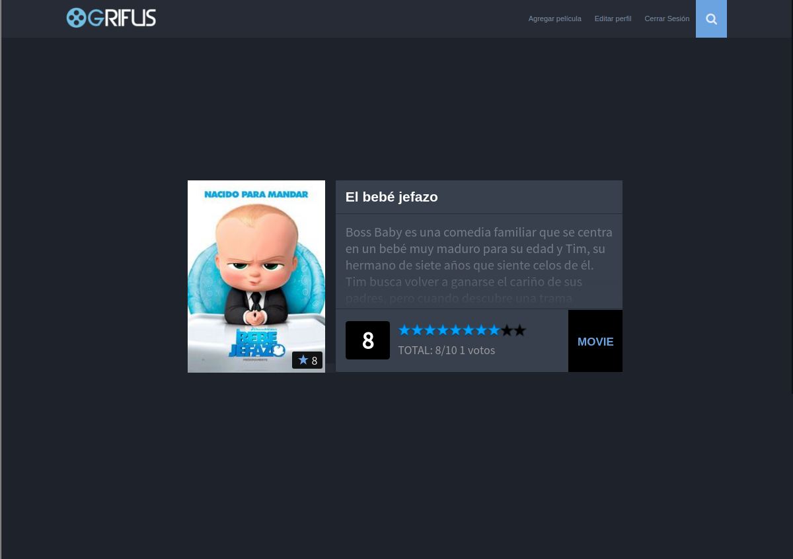
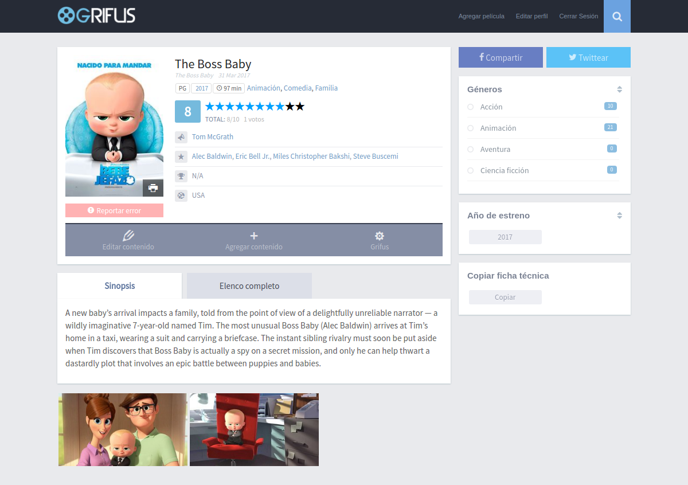
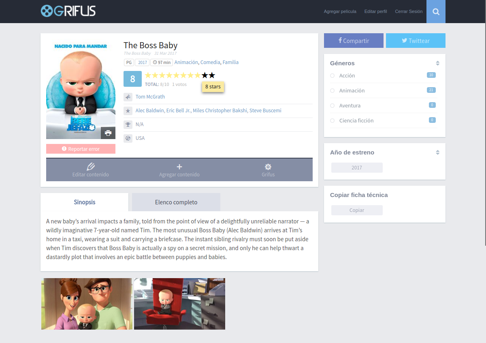
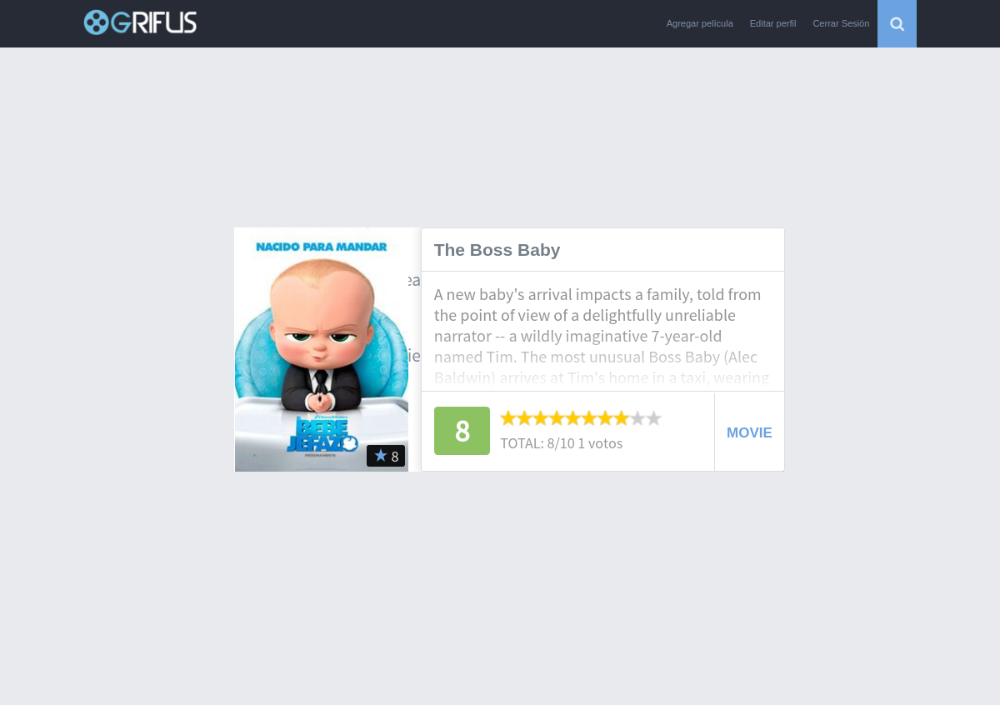
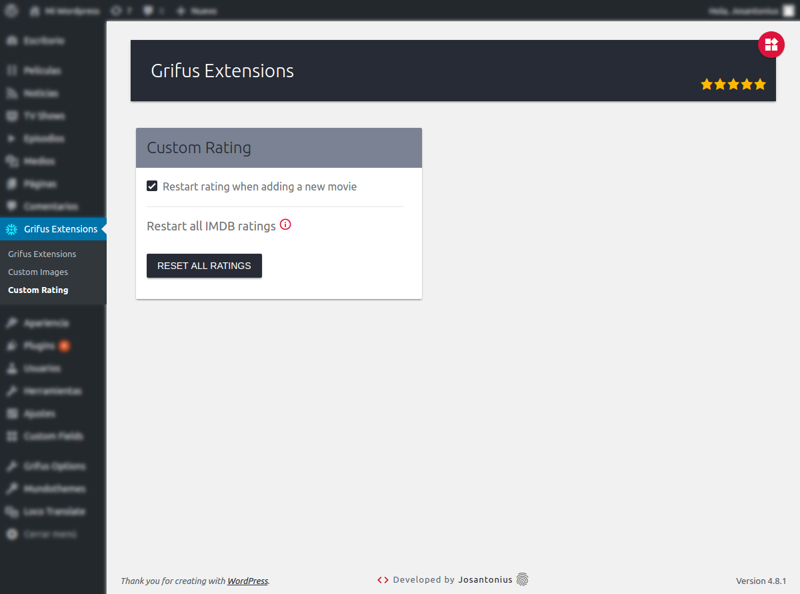
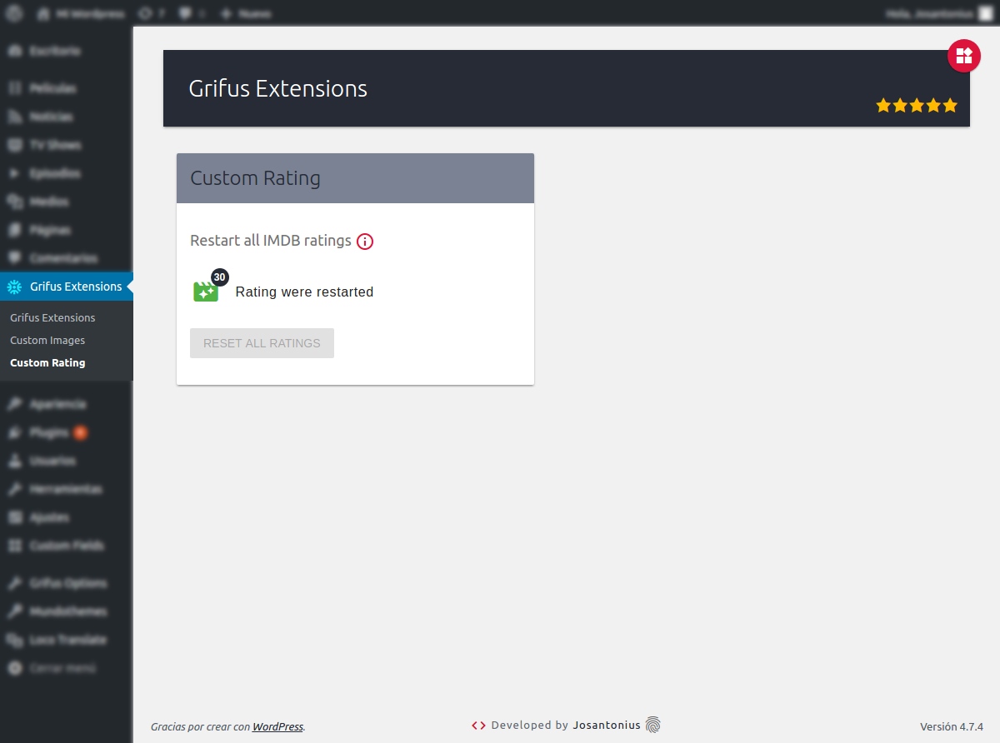

# Extensions For Grifus · Custom Rating

   

[Versión en español](README-ES.md)

Replaces IMDB rating by your own rating system in Grifus theme.

---

- [Installation](#installation)
- [Requirements](#requirements)
- [Images](#images)
- [Contribute](#contribute)
- [Licensing](#licensing)
- [Copyright](#copyright)

---

Custom Rating Grifus replaces the static rating system of the Grifus theme by a dynamic rating system.

### Installation

You can download this plugin from the [official repository](https://es.wordpress.org/plugins/extensions-for-grifus/) in WordPress.

Install full plugin from [Composer](http://getcomposer.org/download/). In the root folder of WordPress run:

    $ composer require josantonius/extensions-for-grifus

Install plugin module from [Composer](http://getcomposer.org/download/). In the root folder of Extensions For Grifus plugin run:

    $ composer require josantonius/custom-rating-grifus

The previous command will only install the necessary files, if you prefer to download the entire source code (including tests, vendor folder, sass files, docs...) you can use:

    $ composer require josantonius/custom-rating-grifus --prefer-source

Or you can also clone the complete repository with Git:

	$ git clone https://github.com/Josantonius/Custom-Rating-Grifus.git

From your WordPress dashboard:

	1. Visit 'Plugins > Add New'
	2. Search for 'Extensions For Grifus'
	3. Activate Extensions For Grifus from your Plugins page.
	4. Access the Grifus Extensions menu.
	5. Activate the modules you want to use.

From WordPress.org:

	1. Download [Extensions For Grifus](https://es.wordpress.org/plugins/extensions-for-grifus/).
	2. Upload the 'extensions-for-grifus' directory to your '/wp-content/plugins/' directory, using your favorite method (ftp, sftp, scp, etc...).
	3. Activate Extensions For Grifus from your Plugins page.
	4. Access the Grifus Extensions menu.
	5. Activate the modules you want to use.

Once Activated:

	Go to Grifus Extensions > Custom Images and click the button to reset all ratings.

### Requirements

This pluggin is supported by PHP versions 5.3 or higher and is compatible with HHVM versions 3.0 or higher.

### Images

### Contribute
1. Check for open issues or open a new issue to start a discussion around a bug or feature.
1. Fork the repository on GitHub to start making your changes.
1. Write one or more tests for the new feature or that expose the bug.
1. Make code changes to implement the feature or fix the bug.
1. Send a pull request to get your changes merged and published.

This is intended for large and long-lived objects.

### Licensing

This project is licensed under **GPL-2.0+**. See the [LICENSE](LICENSE) file for more info.

### Copyright

2017 Josantonius, [josantonius.com](https://josantonius.com/)

If you find it useful, let me know :wink:

You can contact me on [Twitter](https://twitter.com/Josantonius) or through my [email](mailto:hello@josantonius.com).
